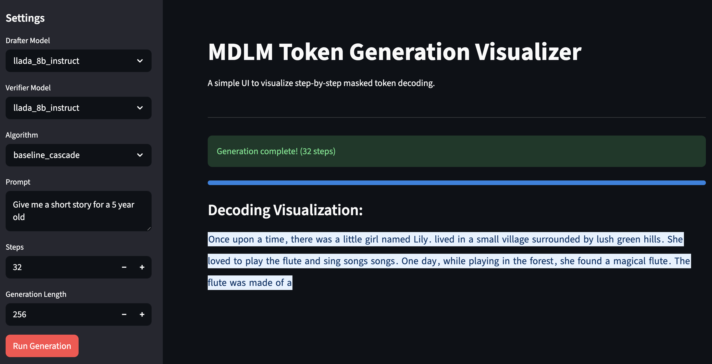

# MDLM Visualizer

This folder contains a local web application built with [Streamlit](https://streamlit.io/) to visually demonstrate the step-by-step masked token decoding process of the MDLM.

## Prerequisites

Ensure you have Streamlit installed in your Python environment:

```bash
pip install streamlit
```

## How to Run

From the root directory of the `dvd` project, run the following command to start the app:

```bash
streamlit run vis/app.py
```

This will launch a local web server and automatically open the application in your default web browser.

## Usage

1. **Model Selection:** Choose both a **Drafter Model** and a **Verifier Model** from the dropdowns on the sidebar. These are populated directly from your `registry.yaml`.
2. **Algorithm:** Select the verification/generation algorithm you want to use (e.g., `baseline_cascade`).
3. **Parameters:**
   - **Prompt:** Enter the initial text prompt.
   - **Steps:** Set the number of generation/diffusion steps.
   - **Generation Length:** Set the total number of tokens to generate. *(Note: Generation Length must be divisible by the number of Steps).*
4. **Run Generation:** Click the "Run Generation" button. 

The UI will dynamically update at each step showing the progressive decoding of tokens, highlighting the `[MASK]` tokens in red and resolved text in blue.

## Example


